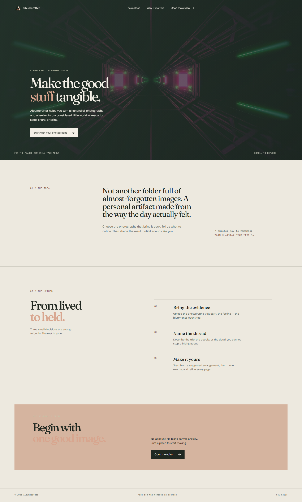
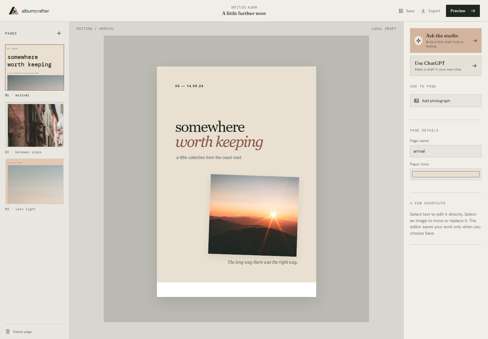
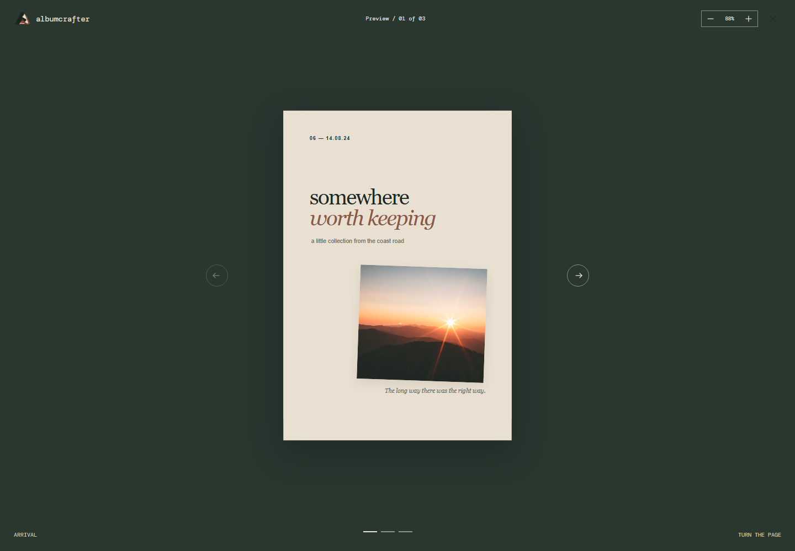
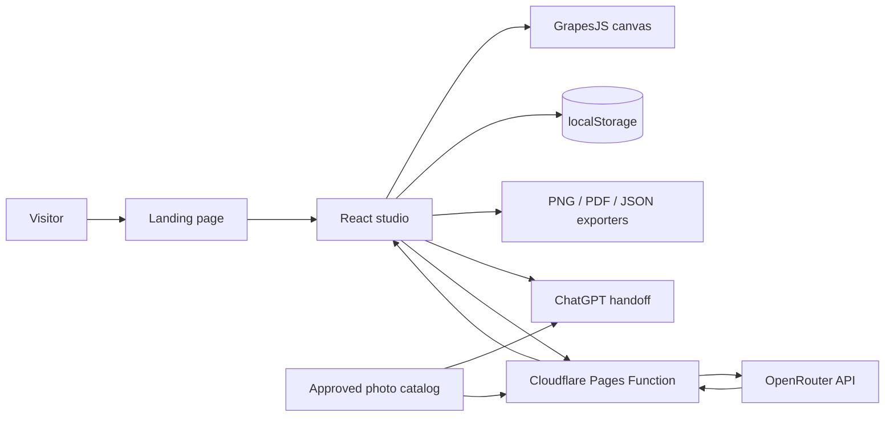
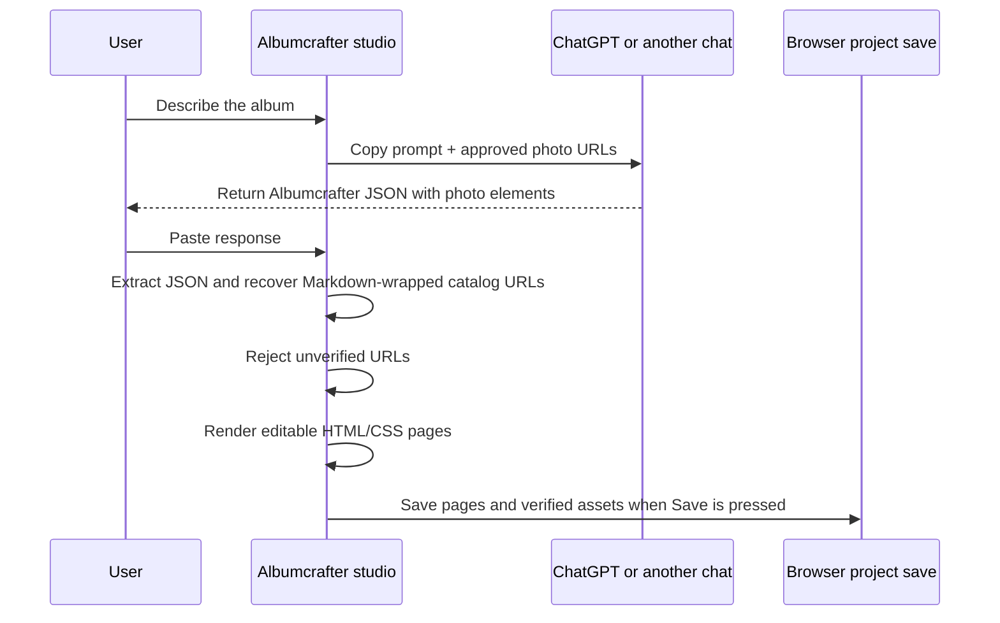
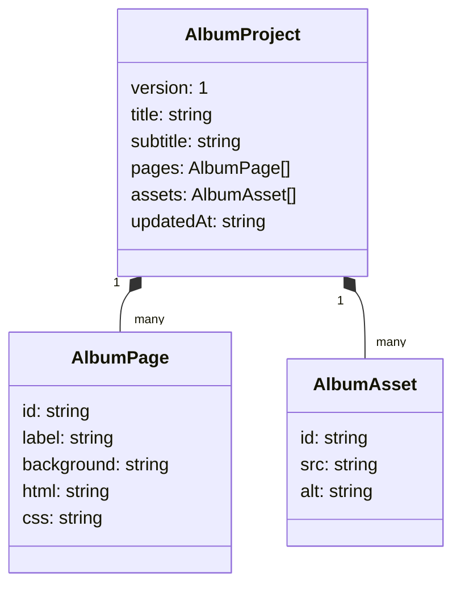

# Albumcrafter

Albumcrafter is a local-first photo album studio for turning photographs, a feeling, and a little editorial direction into an editable keepsake. It is designed around considered layouts, print-friendly exports, and a small amount of AI assistance without handing control of the book to the model.

> Prototype status: the editor, OpenRouter route, ChatGPT handoff, local project save, PNG/PDF export, and Cloudflare Pages packaging are implemented. Persistent accounts, remote project storage, payments, and production print fulfillment are not included yet.

## Product tour

### Landing page

The landing page uses the supplied looping video as atmosphere, with small editorial sections that explain the making process.



### Studio editor

The studio keeps the page rail, editable canvas, and tools visible together. GrapesJS provides direct HTML/CSS editing while Albumcrafter owns the project model and save/export actions.



### Preview

Preview fits the page to the viewport by default, supports zoom controls, and animates page turns in opposite directions for next and previous navigation.



## What is included

- Landing page with the supplied `Albumcrafter.mp4` hero video and a softened loop transition.
- Three-page starter album with warm paper, ink, clay, and moss tones.
- GrapesJS canvas for editing page HTML and CSS.
- Uploads for JPG, PNG, and WebP photographs up to 4 MB per file.
- Explicit local save to browser `localStorage`.
- Project JSON export containing pages and saved photo assets.
- Current-page PNG export and whole-album PDF export.
- Fit-first animated preview with zoom in/out controls.
- Ask the studio flow backed by an OpenRouter Cloudflare Pages Function.
- ChatGPT handoff that copies a structured prompt, opens a configurable chat URL, and imports pasted JSON.
- Curated photo catalog shared by the handoff and OpenRouter flows.
- Strict photo URL validation, friendly error toasts, and verified asset persistence.
- CSP/security headers in `public/_headers`.

## Architecture



### AI handoff and asset validation



### Project model



## Tech stack

| Area | Choice |
| --- | --- |
| UI | React 19 + TypeScript |
| Build | Vite |
| Editor | GrapesJS |
| Sanitization | DOMPurify |
| Raster export | html-to-image |
| PDF export | jsPDF |
| AI gateway | Cloudflare Pages Function + OpenRouter |
| Hosting target | Cloudflare Pages |
| Persistence | Browser localStorage for the prototype |

## Requirements

- Node.js 18+ recommended
- npm
- A modern browser
- OpenRouter API key only if using Ask the studio

## Local setup

```bash
npm install
cp .env.example .env
npm run dev
```

On PowerShell, use:

```powershell
npm install
Copy-Item .env.example .env
npm run dev
```

Open `http://localhost:5173/` for the landing page or `http://localhost:5173/craft` for the studio.

The ChatGPT handoff works without an API key. It copies the prompt to the clipboard, opens the configured chat URL, and accepts the returned JSON through the import modal.

## Environment variables

| Variable | Used by | Required | Purpose |
| --- | --- | --- | --- |
| `OPENROUTER_API_KEY` | Cloudflare Function | Ask the studio only | Server-side OpenRouter credential. Never expose it as a `VITE_` variable. |
| `OPENROUTER_MODEL` | Cloudflare Function | No | OpenRouter model; defaults to `google/gemini-2.5-flash`. |
| `VITE_LLM_HANDOFF_URL` | Browser | No | Base URL for the external chat handoff; defaults to `https://chatgpt.com/?q=`. |
| `VITE_LLM_HANDOFF_NAME` | Browser | No | Display name for the handoff provider; defaults to `ChatGPT`. |

The checked-in `.env.example` is safe to copy. Real `.env` files are ignored by `.gitignore`.

## AI response contract

The handoff and OpenRouter flows return one JSON object:

```json
{
  "version": 1,
  "album": {
    "title": "A little further west",
    "subtitle": "A field book from the coast road",
    "palette": ["#F3EFE6", "#2F3B3A"]
  },
  "pages": [
    {
      "id": "page-1",
      "background": "#F3EFE6",
      "elements": [
        {
          "id": "photo-1",
          "type": "image",
          "x": 8,
          "y": 8,
          "width": 84,
          "height": 60,
          "rotation": 0,
          "zIndex": 1,
          "src": "exact URL from the approved catalog",
          "photoId": "coast-road",
          "alt": "A sunlit road through a green landscape"
        }
      ]
    }
  ]
}
```

The importer accepts optional Markdown fences and can recover a catalog URL when a chat provider incorrectly wraps it in Markdown-link syntax. It still rejects URLs that cannot be matched to the approved catalog and requires at least one verified image element.

## Saving and exporting

Saving is intentionally explicit:

1. Edit pages, upload photographs, or import an AI draft.
2. Choose **Save** to write the current project to this browser.
3. Choose **Export** for one of the following:

| Export | Result |
| --- | --- |
| Current page · PNG | 2× raster image of the active page |
| Whole album · PDF | One print-sized portrait page per album page |
| Project · JSON | Reopenable project data including verified assets |

Uploaded photographs are stored as data URLs in the local project. This is useful for a prototype, but a real product should move binary storage to object storage before supporting large albums.

## Cloudflare Pages deployment

The project is configured for Pages in `wrangler.toml` with `dist` as the build output and `functions/` as the Pages Functions directory.

```bash
npx wrangler login
npm run build
npx wrangler pages project create albumcrafter
npx wrangler pages secret put OPENROUTER_API_KEY --project-name albumcrafter
npm run deploy
```

If the Pages project already exists, skip `pages project create`. Set `OPENROUTER_MODEL` in the Cloudflare Pages environment if you want to override the checked-in default. Keep `OPENROUTER_API_KEY` as a Pages secret.

For a local Pages-shaped runtime:

```bash
npm run pages:dev
```

## Verification commands

```bash
npm run build
npm audit --omit=dev
npx wrangler pages functions build functions --outdir .wrangler/functions-build
```

The browser smoke checks used for the current prototype cover:

- Landing route and CTA navigation.
- Editor route and responsive overflow.
- Favicon/logo delivery.
- Preview fit, zoom, next animation, and opposite previous animation.
- Non-transparent PNG export.
- Image-bearing PDF export.
- ChatGPT handoff JSON import, verified photo recovery, and local save.

## Repository layout

```text
.
├── Albumcrafter.mp4             # supplied landing video
├── functions/api/
│   └── generate-layout.ts       # OpenRouter Pages Function
├── public/
│   ├── _headers                  # security and CSP headers
│   ├── albumcrafter-mark.png     # generated brand mark
│   └── favicon.png               # browser favicon
├── output/playwright/            # README screenshots and captured artifacts
├── src/
│   ├── App.tsx                   # routes, studio, handoff, export, preview
│   ├── content.ts                # starter album pages
│   ├── icons.tsx                 # inline icon set
│   ├── photo-library.ts          # approved photo catalog
│   ├── styles.css                # landing and studio styling
│   └── types.ts                  # project and AI response types
├── index.html
├── package.json
└── wrangler.toml
```

## Security and production notes

- AI-generated HTML is sanitized with DOMPurify before rendering or exporting.
- The OpenRouter credential is read only inside the Cloudflare Function.
- CSP and browser security headers are defined in `public/_headers`.
- External photo URLs are allowlisted before they become album assets.
- User uploads remain in the browser in this prototype; they are not uploaded to OpenRouter.
- Before production launch, add authentication, server-backed projects, object storage, upload quotas, abuse limits, structured logging, and a print-provider integration.

## Current limitations

- Projects are tied to one browser until JSON export/import is used.
- The approved photo catalog is intentionally small and should become configurable per template.
- ChatGPT handoff depends on the user copying the generated response back into the studio.
- PDF export is print-sized for the prototype, not yet tied to selectable printer stock.
- Vite reports a bundle-size warning because GrapesJS and jsPDF are large; PNG/PDF are already dynamically imported.

## License

No license has been selected for this prototype yet.
